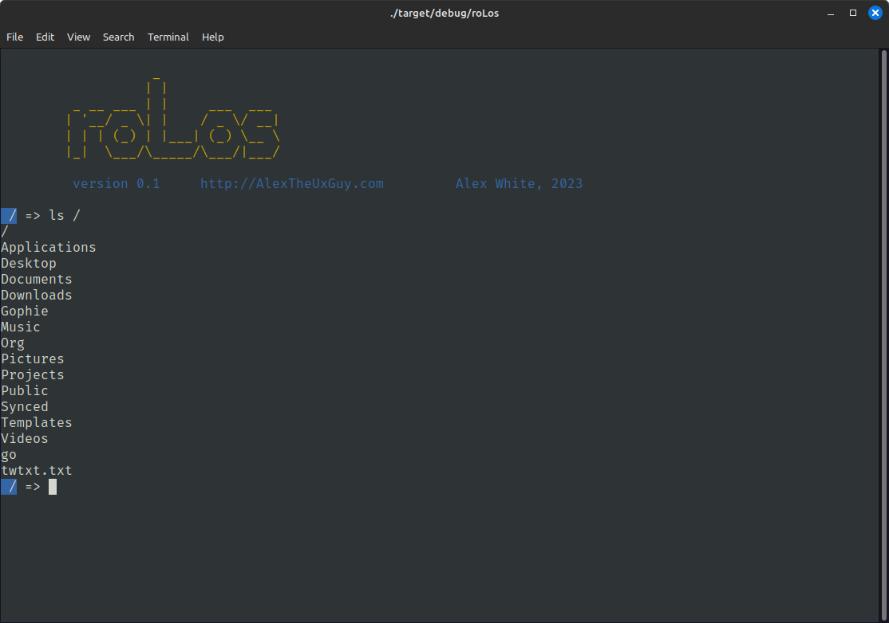

# roLos - A "smol OS" written in Rust

roLos is a collection of modules that form something resembling a small "operating system".

Currently roLos is composed of:
- Shell (rsh)
- Applications
    - neofetch
    - ls
- Virtual filesystem (fs)

## Goals
Some features I want to eventually add
- A text editor
- Full filesystem commands
- Tokenizer
- Custom shell script language
- Custom terminal emulator built with QT
- Desktop environment
- Support for web via Web Assembly

## Contributing
Getting started with roLos is easy. Make sure you have Rust on your system, clone the repo, then run `cargo run`.

